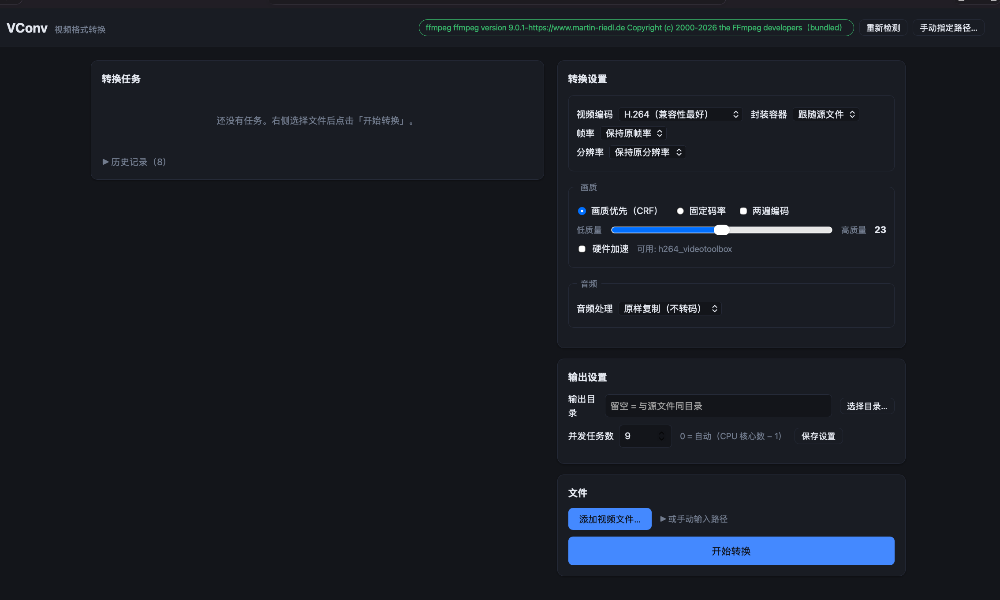

# VConv — 视频格式转换工具

基于 [FFmpeg](https://ffmpeg.org/) 的本地视频格式转换软件：**多核并行批量转换**，支持转换**编码格式、帧率、分辨率、码率/画质**，可选**硬件加速**，以及**音频转码/提取**。跨平台（macOS / Windows），界面为本地网页（浏览器访问，无需联网）。



## 功能特性

- **批量并行转换**：一次添加多个文件，自动用满 CPU 核心（并发数可调，0 = 自动取核心数 − 1）
- **磁盘镜像工具**：文件夹打包成 ISO / DMG，从 ISO / DMG / IMG 提取内容（macOS 全功能，Windows 支持提取 ISO）
- **视频编码转换**：H.264 / H.265 (HEVC) / AV1 / VP9（常用），另有 MPEG-4 / MPEG-2 / VP8 / ProRes / MJPEG（界面「更多格式」分组），或仅改封装不转码（无损封装）
- **帧率转换**：23.976 / 24 / 25 / 30 / 50 / 60 fps 或自定义（1–120）
- **分辨率缩放**：4K / 1080p / 720p 或自定义宽高（自动保持偶数尺寸，避免 yuv420p 报错）
- **画质控制**：CRF 画质滑块（每个编码独立推荐范围）、质量档位 q:v（MPEG-4/MPEG-2/MJPEG）、ProRes 档位（Proxy/LT/Standard/HQ）、固定码率、两遍编码（x264/x265/VP9/VP8/MPEG-4/MPEG-2）
- **硬件加速**：自动检测 macOS VideoToolbox、NVIDIA NVENC、Intel QSV、AMD AMF
- **音频处理**：原样复制 / 转 AAC・Opus・MP3・FLAC・AC-3 / 去音轨 / 仅提取音频（M4A・Opus・MP3・WAV・FLAC・AC-3）
- **实时进度**：每个任务显示进度条、转换速度、剩余时间；失败时展开查看详细日志
- **安全**：绝不覆盖已有文件（自动重命名为 `xxx (1).mp4`）；取消任务会清理半成品
- **纯本地**：服务只监听 `127.0.0.1`，数据不出本机

## 支持格式

界面中「常用格式」与「更多格式」分组显示：

| 类别 | 常用 | 更多 |
|---|---|---|
| 视频编码 | H.264・H.265・AV1・VP9・不转码 | MPEG-4・MPEG-2・VP8・ProRes・MJPEG |
| 封装容器 | MP4・MKV・MOV・WebM | AVI・FLV・M4V・TS |
| 音频 | 复制・AAC・Opus・MP3・去音轨・提取 | FLAC・AC-3 |
| 镜像工具 | ISO・DMG | IMG 等（提取，macOS） |

## 快速开始

### 方式一：源码运行（需 Python 3.9+）

```bash
git clone https://github.com/heidagu/vconv.git
cd vconv
python3 -m venv .venv
source .venv/bin/activate            # Windows: .venv\Scripts\activate
pip install -r requirements.txt
python run.py                        # 自动打开浏览器
```

### 方式二：下载打包产物（无需 Python）

从 [Releases](../../releases) 下载对应平台 zip，解压后运行：

- **macOS**：双击 `VConv.app`。首次打开若提示“无法验证开发者”，请**右键 → 打开**（未签名构建，详见 FAQ）
- **Windows**：运行 `VConv.exe`

### ffmpeg 依赖

软件**不随包分发 ffmpeg**（保持本项目 MIT 纯净）。首次使用时：

1. 界面右上角会显示检测状态；未检测到时可**一键下载**静态构建：
   - Windows：gyan.dev LGPL essentials 构建
   - macOS：martin-riedl.de（Apple Silicon）/ evermeet.cx（Intel）官方构建
2. 或点击**手动指定路径…**，选择你已安装的 ffmpeg 可执行文件
3. 下载/指定后自动校验可用性；设置会持久化，重启后仍生效
4. 内网/受限网络下载失败时，请先开启代理再重试，或手动指定本地 ffmpeg

> 注意：ffmpeg 各构建（LGPL/GPL）有其各自许可证，与 VConv 项目本身（MIT）相互独立。

## 使用说明

1. 右侧「转换设置」选择目标编码、容器、帧率、分辨率、画质（不兼容的组合会自动禁用）
2. 「文件」区点击**添加视频文件…**（通过系统原生对话框选择）或粘贴路径
3. 点击**开始转换**，左侧任务列表实时显示进度、速度、剩余时间
4. 可随时**取消**运行中的任务；失败任务点开「错误详情」查看原因；结束任务可删除
5. 「输出设置」可指定输出目录与并发任务数，点击保存后重启仍生效

## 自己打包

```bash
# macOS（本地构建 .app 并自动冒烟测试）
bash packaging/build_macos.sh

# Windows（在 Windows 主机上）
powershell -ExecutionPolicy Bypass -File packaging\build_windows.ps1
```

打 tag `v*` 会触发 GitHub Actions 自动构建并发布 macOS arm64 产物（Windows 备用渠道见 release.yml）。

## 开发

```bash
pip install -r requirements-dev.txt
pytest          # 单测 + 集成测试（需 ffmpeg/ffprobe 可用）
```

CI 在 Ubuntu / macOS / Windows 三平台跑 `pytest` 与语法门（Python 3.9）。

## 常见问题

**macOS 提示“无法打开，因为无法验证开发者”？**
右键（或按住 Control 点击）VConv.app → 打开 → 再点“打开”。本地构建未做代码签名（签名证书需付费开发者账号），不影响功能。

**启动后浏览器没反应 / 打不开页面？**
默认端口 8756，被占用会自动顺延（8757…）。控制台启动时可加 `--port N` 指定端口。

**下载 ffmpeg 失败？**
检查网络/代理；可到 [FFmpeg 官网](https://ffmpeg.org/download.html) 自行下载后，用界面右上角「手动指定路径…」指向 ffmpeg 可执行文件。

**转换很慢？**
尝试开启硬件加速（H.264/H.265 且检测到对应编码器时）；或提高并发任务数（注意：任务数 × ffmpeg 线程数会争抢 CPU，视频转换以 CPU 为主，自动值通常最优）。

**输出文件在哪里？**
默认与源文件同目录，文件名冲突自动加 ` (1)`；可在「输出设置」指定统一输出目录。

## 许可证

[MIT](LICENSE) © 2026 heidagu
